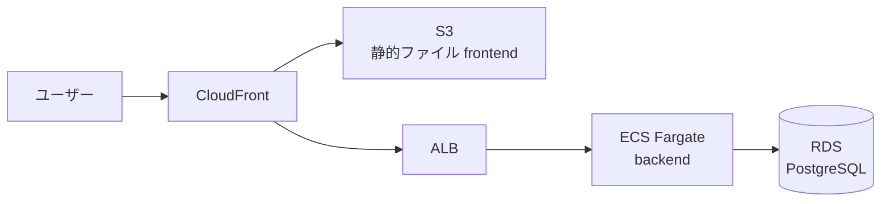

# AWS × Terraform デプロイ手順ガイド(未経験者向け)

このガイドは、java-Course プロジェクト(バックエンド: Spring Boot、フロントエンド: Vite、DB: PostgreSQL)を AWS 上に、AWS マネジメントコンソールを手作業で触らずに、AWS CLI と Terraform を使ってコマンドラインからデプロイできるようにするための手順書です。

AWS・Terraformともに初めて触る人を前提に、専門用語はその都度解説します。実際にAWS上でインフラを作ると多くの場合課金が発生するため、各ステップで「何にお金がかかるか」も併記します。

**全体の流れ**

1. AWSアカウントを作成し、安全な認証設定(IAMユーザー・MFA・アクセスキー)を行う
2. AWS CLIをインストールし、手元のPCからAWSを操作できるようにする
3. Terraformをインストールし、インフラをコードで定義できるようにする
4. このプロジェクトのAWS上での構成(どのサービスを使うか)を決める
5. Terraformコードを書き、`terraform apply`でインフラを作成する
6. 動作確認し、不要になったら`terraform destroy`で片付ける

**前提知識**: Linux/Macのターミナル操作(cd, lsなど)がわかれば十分です。AWSやTerraformの知識は不要です。

## 用語解説

### AWSとは

Amazon Web Services。Amazonが提供するクラウドサービス。自前でサーバを買わず、必要な分だけコンピューターやストレージを使った分だけ課金で借りられる。

### 主要サービス(このプロジェクトで使うもの)

| サービス | 何か | このプロジェクトでの役割 |
| --- | --- | --- |
| IAM | アクセス権限を管理する仕組み | 誰が何をできるかを制御 |
| VPC | 仮想のネットワーク空間 | サーバ群を隔離したネットワークを作る |
| EC2 | 仮想サーバ(仮想マシン) | アプリを動かすサーバ(今回はECSを推奨) |
| ECS/Fargate | コンテナをサーバ管理不要で動かす仕組み | backend/frontendをDockerコンテナとして実行 |
| RDS | マネージド型DB(PostgreSQL等) | DBを自分で運用せずにAWSに任せる |
| S3 | ファイル保存サービス | フロントの静的ファイル(HTML/JS/CSS)を置く |
| CloudFront | CDN(配信高速化) | S3のファイルを世界中に高速配信 |
| ALB | ロードバランサー | アクセスを複数のコンテナに振り分け |

### IAMとは

Identity and Access Management。「誰が」「何に」「どんな操作を」できるかを制御する、AWSの根幹の権限管理サービス。

### Terraformとは

HashiCorp社が開発しているIaC(Infrastructure as Code)ツール。「どんなサーバを、どんな設定で作るか」をテキストファイル(`.tf`)に書いておくと、その通りのインフラを自動で作成・変更・削除できる。

マネコンで手作業すると、「何を設定したか」が人の記憶にしか残らず、再現性がない。Terraformならコードがそのまま設計書になり、Gitで履歴管理もできる。

### ステートファイルとは

Terraformが「今、AWS上に何が存在しているか」を記録しておくファイル(`terraform.tfstate`)。これを見て差分を計算してから変更を適用するため、失うとTerraformが現状を把握できなくなる重要ファイル。後ほど解説するS3+DynamoDBで安全に保管する。

## AWSアカウント作成と認証設定

### 1. AWSアカウントを作る

1. https://aws.amazon.com/jp/ から「コンソールにサインイン」→「新しいAWSアカウントを作成」
2. メールアドレス・パスワード・AWSアカウント名を入力
3. クレジットカード登録(本人確認用。無料利用枠内でも必須)
4. 電話番号SMSでの本人確認
5. サポートプランは「Basic Plan(無料)」でOK

ここで作ったログイン(メール+パスワード)は**「ルートユーザー」**と呼ばれ、このアカウント全体の全権限を持つ。日常作業には使わず、このあと作るIAMユーザーを使うのが鉄則(理由は下記)。

### 2. ルートユーザーにMFA(多要素認証)を設定

コンソール右上のアカウント名→「セキュリティ認証情報」→「MFAデバイスの割り当て」。Google Authenticatorなどのスマホアプリでは QRコードを読み込むだけ。ルートユーザーは全権限なので必ず設定する。

### 3. IAMユーザー(作業用アカウント)を作る

ルートユーザーとIAMユーザーの違い:

| | ルートユーザー | IAMユーザー |
| --- | --- | --- |
| 権限 | 全権限(制限不可) | 必要な権限だけ付与可能 |
| 用途 | アカウント設定・解約等の最初のみ | 日常の作業全般 |
| 漏えた時のリスク | アカウント乗っ取り・高額課金の危険 | 権限を絞ってあれば被害を最小化できる |

手順(IAM Identity Centerを使う方法がAWS推奨だが、最初はシンプルなIAMユーザー+アクセスキーで進める):

1. IAMコンソール→「ユーザー」→「ユーザーを追加」
2. ユーザー名を入力(例: `terraform-admin`)
3. 権限: 学習目的なのでまずは`AdministratorAccess`ポリシーをアタッチ(慎重に扱うこと)
4. 作成後、そのユーザーの詳細→「セキュリティ認証情報」→「アクセスキーを作成」→「CLI」を選択
5. 発行される **Access Key ID** と **Secret Access Key** を控えておく(Secretはこの画面でしか表示されない)

⚠️ アクセスキーはGitに絶対にコミットしない。`.gitignore`に`*.tfvars`や認証情報を含むファイルを必ず追加する。

### 4. AWS CLIをインストールして認証する

Windowsの場合:

```
winget install Amazon.AWSCLI
```

インストール後、ターミナルを開き直して確認:

```
aws --version
```

認証情報を登録:

```
aws configure
```

以下を4つ入力:

- AWS Access Key ID: 先ほどのキー
- AWS Secret Access Key: 先ほどのシークレット
- Default region name: `ap-northeast-1` (東京リージョン)
- Default output format: `json`

確認:

```
aws sts get-caller-identity
```

自分のIAMユーザー情報が返ってくれば成功。この認証情報をTerraformもそのまま使用する。

### 5. 予算アラートを設定(強く推奨)

Billingコンソール→「予算」→月額上限(例: $5)を設定し、超えそうならメール通知が来るようにする。意図せず高額課金される事故を防ぐため。

## Terraformのセットアップ

### インストール

Windows(winget):

```
winget install HashiCorp.Terraform
```

確認:

```
terraform -version
```

### バージョン管理(tfenv, 任意)

複数プロジェクトでTerraformのバージョンを切り替えたい場合は`tfenv`(macOS/Linux向け)やWindowsなら`tfswitch`を使う。本プロジェクト規模では必須ではない。

### プロバイダ設定

Terraformは「プロバイダ」というプラグイン経由でAWSと通信する。プロジェクトのルートに`provider.tf`を作成:

```hcl
terraform {
  required_version = ">= 1.9"
  required_providers {
    aws = {
      source  = "hashicorp/aws"
      version = "~> 5.0"
    }
  }
}

provider "aws" {
  region = "ap-northeast-1"
}
```

認証情報は`.tf`ファイルには書かない。`aws configure`で登録済みの認証情報をTerraformが自動で拾う。

### ディレクトリ構成のベストプラクティス

小規模な構成なら、まずはフラットな構成から始めるのが分かりやすい:

```
infra/
  provider.tf      # プロバイダ・Terraformバージョン
  backend.tf        # stateの保存先設定(S3+DynamoDB)
  variables.tf      # 入力変数定義
  main.tf           # リソース定義(まずはここにまとめてOK)
  outputs.tf         # 作成後に表示したい値(URLなど)
  terraform.tfvars  # 実際の値(Git管理外)
```

規模が大きくなったら`main.tf`を`network.tf`(VPC等)、`ecs.tf`、`rds.tf`などに分割していく。最初からモジュール化しすぎないことが重要(未経験者はまず全体像を把握する方が優先)。

### 基本コマンド

| コマンド | 役割 |
| --- | --- |
| `terraform init` | プロバイダをダウンロードし、作業ディレクトリを初期化 |
| `terraform plan` | 何が作成・変更・削除されるかを事前確認(実行されない) |
| `terraform apply` | planの内容を実際に適用 |
| `terraform destroy` | 作成したリソースを全て削除 |
| `terraform fmt` | コード整形 |
| `terraform validate` | 文法チェック |

## このプロジェクト(java-Course)をAWSにデプロイする設計

バックエンド(Spring Boot / 8080)・フロントエンド(Vite / 5173)・DB(PostgreSQL / 5432)の3層構成を、どうAWSに写し取るかを比較する。

### 構成パターンの比較

| 方式 | 概要 | コスト目安(最小構成/月) | 難易度 |
| --- | --- | --- | --- |
| EC2単体 | 1台のEC2上でbackend/frontend/DBを全て動かす | 最も安い($0〜数ドル、無料枠内ならほぼ$0) | 最も簡単 |
| ECS Fargate + RDS + S3/CloudFront(推奨) | コンテナ・マネージドDB・CDNで実業務に近い構成 | 約$15〜30 | 中 |
| EKS(Kubernetes) | コンテナオーケストレーションの本格流 | 約$75〜(クラスタ代だけで$0.10/時間) | 高 |

未経験者が学習として一番学べるものが大きいのは真ん中の**ECS Fargate + RDS + S3/CloudFront**。EC2単体は安価だが実務でもゆる構成とは言い難く、EKSはオーバースペック。以降このガイドではECS構成を前提に進める。

### 推奨構成の全体図



| 層 | 現状(ローカル) | AWS上での実装 |
| --- | --- | --- |
| フロント(Vite) | `npm run build`で静的ファイル化 | S3にビルド成果物をアップロードし、CloudFrontで配信 |
| バックエンド(Spring Boot) | ローカルで`8080`起動 | Dockerイメージ化→ECRにプッシュ→ECS Fargateで実行 |
| DB(PostgreSQL) | `docker-compose`で`5432` | RDS(PostgreSQL)でマネージド化 |
| 入口 | ブラウザ直接 | CloudFront(フロント) + ALB(APIパス) |

フロントからバックエンドへのAPI呼び出しはCloudFrontのパスベースルーティング(例: `/api/*`をALBに転送)でまとめると、ローカル開発時のViteプロキシ設定と同じ感覚でCORS問題を避けられる。

### 必要な主なAWSリソース一覧

- VPC(パブリック/プライベートサブネット) × 2AZ
- ECR(Dockerイメージ保存先)
- ECSクラスタ + Fargateサービス(backend)
- ALB(HTTP/HTTPS受け口)
- RDS(PostgreSQL, プライベートサブネット内)
- S3(frontend静的ファイル)
- CloudFront(CDN・入口)
- IAMロール(ECSタスク実行用)
- Secrets Manager(DBパスワードなどの機密情報)

## Terraformコードの実装手順

### 1. stateをS3+DynamoDBで管理する(最初に一度だけ)

デフォルトではstateがローカルの`terraform.tfstate`に保存されるが、これだとPCが壊れたり複数人で作業したりできない。S3(保存先)+DynamoDB(同時書き採用防止のロック)に逃すのが定番。

この基盤自体は別ディレクトリ(例: `infra/bootstrap/`)で一回だけ`apply`して作る(本体のstateを管理するリソースを本体と同じstateで管理するのは矛盾するため):

```hcl
# infra/bootstrap/main.tf
resource "aws_s3_bucket" "tfstate" {
  bucket = "java-course-tfstate"
}

resource "aws_s3_bucket_versioning" "tfstate" {
  bucket = aws_s3_bucket.tfstate.id
  versioning_configuration { status = "Enabled" }
}

resource "aws_dynamodb_table" "tflock" {
  name         = "java-course-tflock"
  billing_mode = "PAY_PER_REQUEST"
  hash_key     = "LockID"
  attribute {
    name = "LockID"
    type = "S"
  }
}
```

作成後、本体の`infra/backend.tf`で参照:

```hcl
terraform {
  backend "s3" {
    bucket         = "java-course-tfstate"
    key            = "prod/terraform.tfstate"
    region         = "ap-northeast-1"
    dynamodb_table = "java-course-tflock"
    encrypt        = true
  }
}
```

### 2. リソース定義の流れ(main.tf)

早い段階で完璧を目指さず、以下の順番で少しずつ`terraform plan`しながら進めるのが安全:

1. VPC・サブネット・ルーティングテーブル
2. RDS(PostgreSQL)とそのセキュリティグループ
3. ECRリポジトリ(backendのイメージ置き場)
4. ECSクラスタ・Fargateタスク定義・ALB
5. S3(frontend)とCloudFront
6. IAMロール・Secrets Manager

### 3. 変数化する

リージョン、インスタンスタイプ、DBパスワードなどは`variables.tf`で定義し、`terraform.tfvars`(Git管理外)に実値を入れる:

```hcl
# variables.tf
variable "db_password" {
  type      = string
  sensitive = true
}

variable "environment" {
  type    = string
  default = "dev"
}
```

### 4. デプロイの実行コマンド

```
cd infra
terraform init
terraform plan -out=tfplan
terraform apply tfplan
```

`plan`の出力で`+`(作成)`~`(変更)`-`(削除)を必ず確認してから`apply`する。意図しない削除が混じっていないかのチェックが最も重要なステップ。

## AI(Claude Code)を使ったコマンドラインデプロイの進め方

「AWSマネコンを手でいじらず、AIにAWS CLI/Terraformを使わせてデプロイさせる」というやり方は、以下の流れで進めると安全。

### 基本の進め方

1. このガイドの手順でAWSアカウント作成と`aws configure`は**人間が自分で行う**(AIにAWSアカウント作成や認証情報の発行は任せられない)
2. `aws sts get-caller-identity`が通れば、その後はTerraformコードの作成・AWS CLIコマンドの実行をClaude Codeに依頼できる
3. Claude Codeに依頼する際は「`terraform plan`まで実行して内容を見せて、`apply`は確認後にして」と依頼する

### Claude Codeで実行する際の注意点

- **`terraform apply`や`terraform destroy`は実際のクラウド課金やデータ削除を伴う不可逆な操作**なので、Claude Codeに実行させる前に必ず`plan`の内容を自分で確認する
- AWSの認証情報(アクセスキーなど)をチャット上に貼り付けない(ローカルの`~/.aws/credentials`を参照させれば十分)
- 本番環境と検証環境(dev/staging)を分けたい場合はTerraformの**workspace**機能や、ディレクトリごとに`tfvars`を分ける方法がある(本ガイドでは小規模なのでdev 1環境を前提)
- CI/CD(GitHub Actionsなど)で自動化する場合はOIDC連携(IAM RoleをGitHub Actionsに一時的に引き実行させる)が推奨。長期アクセスキーをCIにsecretsとして埋め込むのは避ける

### 承認フロー(本リポジトリの運用ルールとの接続)

このリポジトリの[CLAUDE.md](../CLAUDE.md)はGitHub上の操作(Issue作成・branch切りもの・PR作成)は事前確認を必須としている。AWS/Terraformも同様の考え方で進める:

1. 「AWSにデプロイする」作業もGitHub Issueを作成し、`feature/<issue番号>-terraform-setup`などのブランチで進める
2. `terraform apply`の実行自体はGitHub上の操作ではないが、実際に課金が発生する・AWS上のリソースを変更する操作なので、実行前に必ずユーザーへ確認する
3. Terraformコード自体はPRでレビューしてから`main`にマージし、その後に実際の環境へ`apply`するのが安全

## コスト管理とセキュリティの注意点

### 無料利用枠(学習用途なら活用)

AWSの無料利用枠はアカウント作成から12ヶ月限定のものが多い(EC2 t2.micro/t3.microなど)。RDSも小規模インスタンスは無料枠対象の場合があるが、**ECS Fargateは基本的に無料枠対象外**なので小額の課金が発生することを前提にする(最小構成で月数ドル程度)。最新の無料枠の条件はAWS公式ページで必ず確認する。

### 予算アラート(再掲)

前述の通りBillingコンソールで月額上限を設定しておく。加えてAWS Cost Explorerで定期的に課金状況を確認するのも有効。

### 最小権限の原則(Principle of Least Privilege)

- 日常作業は`AdministratorAccess`ではなく、必要なサービス(EC2/ECS/S3/RDS/IAM等)のみに絞ったカスタムポリシーに後で絞ると安全
- ECSタスクのIAMロールは「そのコンテナが必要とする最小限の権限」のみ付与する(例: Secrets Managerの特定のシークレットのみ取得可)
- RDSはパブリックサブネットには置かず、プライベートサブネット内に配置し、ECSからのみ接続できるセキュリティグループを設定する
- DBパスワードなどの機密情報はTerraformコードに平文で書かず、AWS Secrets Managerや`sensitive = true`変数を使う

### 破棄手順(不要になったら必ず実行)

学習や検証が終わったら、課金を止めるために必ずリソースを削除する:

```
cd infra
terraform plan -destroy
terraform destroy
```

※ `destroy`は不可逆。RDSのデータやS3のファイルも全て消えるため、必要なデータは事前にバックアップする。実行前に必ず`plan -destroy`で対象を確認する。

※ state管理用のS3/DynamoDB(bootstrap)は本体とは別管理なので、本当に全て不要になった場合は最後に手動で削除する。

## 次のステップとよくある詰まりポイント

### 次のステップ

1. AWSアカウントを作成し、IAMユーザー・MFA・`aws configure`を完了させる
2. Terraformをインストールし、state管理用のS3/DynamoDB(bootstrap)を作成する
3. VPCだけの小さな`main.tf`から始めて`plan`→`apply`を体験し、Terraformの感覚をつかむ
4. 少しずつRDS、ECR、ECSとリソースを追加していく
5. 動作確認後は必ず`terraform destroy`で片付けて課金を止める

### よくある詰まりポイント

| 事象 | 原因・対処 |
| --- | --- |
| `terraform apply`が権限エラー(AccessDenied) | IAMユーザーのポリシー不足。権限を確認して追加する |
| `Error: state locked` | 他の`apply`が途中で中断されてDynamoDBのロックが残っている。状態を確認し`terraform force-unlock`で解除 |
| フロントからバックエンドAPIにCORSエラー | CloudFrontのパスベースルーティング設定を確認。ALBへのオリジンを正しく設定する |
| 想定外の課金 | 無料枠対象外のサービス(ECS Fargateなど)を使っていないか、NAT Gateway(比較的高額)を使っていないかをCost Explorerで確認 |
| `terraform destroy`が失敗する | 依存関係のあるリソース(ENIやセキュリティグループなど)が残っている。AWSコンソールで手動確認して前後関係を解消 |

### 学習の進め方のヒント

最初から完璧な構成を目指さず、「VPCだけ作って`destroy`」「次はEC2を一台立てて`destroy`」のように小さく何度も回すと、TerraformとAWSの感覚が早くつかめる。
