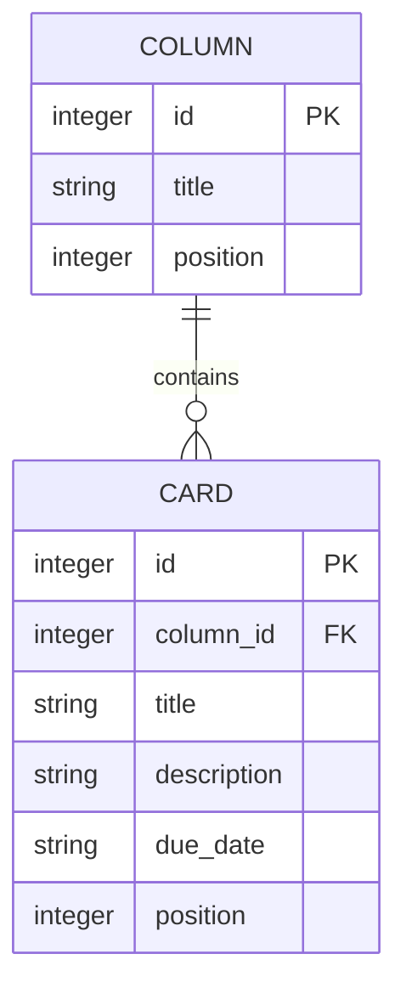

# ER図・データベース設計

[要件定義書](requirements.md)に戻る

本アプリはSQLiteデータベースにデータを保存する。テーブルはColumn（列）とCard（カード）の2つで構成し、Card側からColumnを外部キーで参照する1対多の関係を持つ。

Boardは今回1つのみ存在する想定のため、独立したテーブルとしては持たない（columnsテーブル全体で1つのボードを表す）。将来複数ボードに対応する場合は、`boards`テーブルを追加し、`columns`テーブルに`board_id`（外部キー）を持たせる拡張を想定する。

## 1. ER図



## 2. テーブル定義

**columns テーブル**

| カラム名 | 型 | 説明 |
|---|---|---|
| id | INTEGER (PK, AUTOINCREMENT) | 列を一意に識別するID |
| title | TEXT | 列の名前（例：未着手） |
| position | INTEGER | 列の表示順 |

**cards テーブル**

| カラム名 | 型 | 説明 |
|---|---|---|
| id | INTEGER (PK, AUTOINCREMENT) | カードを一意に識別するID |
| column_id | INTEGER (FK → columns.id) | このカードが属する列のID |
| title | TEXT | カードの名前（必須） |
| description | TEXT | カードの詳細メモ（任意） |
| due_date | TEXT | 締め切り日（任意） |
| position | INTEGER | 列内でのカードの表示順 |

属性の詳細な説明は「4. データ項目一覧」も参照。

## 3. データ関係のイメージ（参考）

```
columns
 ├─ id:1 title:未着手
 │    └─ cards: id:1(カードA), id:2(カードB)
 ├─ id:2 title:進行中
 │    └─ cards: id:3(カードC)
 └─ id:3 title:完了
      └─ cards: （なし）
```

## 4. データ項目一覧

各項目のデータベース上のカラム名・型は「2. テーブル定義」を参照。ここでは項目の意味を一覧化する。

| データ | 項目 | 説明 |
|---|---|---|
| 列（Column） | ID | 内部的に列を識別するための値 |
| | タイトル | 列の名前（例：未着手） |
| | 表示順 | 列の並び順を保持する値 |
| カード（Card） | ID | 内部的にカードを識別するための値 |
| | 所属する列のID | このカードがどの列に属するかを示す値 |
| | タイトル | カードの名前（必須） |
| | 説明文 | カードの詳細メモ（任意） |
| | 期日 | 締め切り日（任意） |
| | 表示順 | 同じ列内でのカードの並び順を保持する値 |
