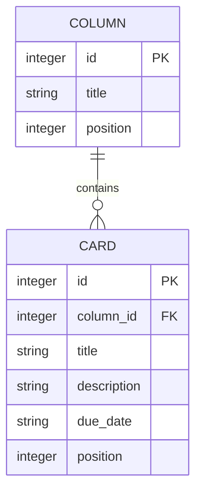

# タスク管理アプリ 要件定義書

## 1. 目的・背景

本アプリは、プログラミングスクールの課題として制作するものであり、目的は実務上のビジネス課題を解決することではなく、**学習**にある。

### 1.1 学習目標

- 素のHTML/CSS/JavaScript（フロントエンドのフレームワーク・ビルドツールなし）によるDOM操作の実装経験を積む
- ドラッグ＆ドロップAPIを用いたUI操作の実装経験を積む
- 実際のデータベース（SQLite）とバックエンドAPI（Node.js/Express）を用いたシステムの設計・構築・運用の経験を積む
- 要件定義 → 画面設計 → データベース設計 → 実装 → 運用という、開発の一連の流れを一通り経験する

### 1.2 題材の選定理由

Trello風のタスク管理アプリ（カンバンボード）を題材に選んだ理由は、以下の基本要素を一通り含んでおり、学習素材として適切だと考えたため。

- データのCRUD（作成・参照・更新・削除）
- 状態管理（列・カードの構造化データ管理）
- ドラッグ＆ドロップによるUI操作
- データベース設計とAPIを介したデータの永続化

個人でタスクを管理する用途として、機能をできるだけ絞り込んだシンプルな構成で作る。なお、当初はサーバー・データベースを持たない構成（`localStorage`のみ）を想定していたが、実際のデータベースを用いた運用まで学習したいという意向から、後述（8章）の通りSQLite＋バックエンドAPIを用いる構成に変更した。

## 2. 想定利用者・利用環境

- 利用者：開発者本人（1人での利用のみを想定）
- 利用環境：自分のパソコン上のWebブラウザ（Chrome、Edge、Firefoxなど）
- インターネット接続は不要。自分のパソコン内でサーバーを起動し、ブラウザからアクセスして使う（詳細は5章参照）。

## 3. ユースケース

代表的な利用シーンを以下に示す。

- 新しいタスクを思いついたので、「未着手」列にカードを追加する
- 作業に着手したので、カードを「未着手」列から「進行中」列へドラッグ＆ドロップで移動する
- タスクが完了したので、カードを「完了」列へ移動する
- 不要になった列やカードを削除する
- ブラウザを再度開いて、前回入力した内容が残っていることを確認する

### 3.1 ユースケース例（カードを別の列に移動する）

| 項目 | 内容 |
|---|---|
| アクター | 利用者本人 |
| 目的 | 進行中のタスクを正しい列に反映し、状況を把握しやすくする |
| 事前条件 | ボードに1つ以上のカードが存在する |
| 基本フロー | 1. 利用者が移動したいカードをドラッグする<br>2. 移動先の列までドラッグしてドロップする<br>3. カードが移動先の列の末尾（もしくは指定位置）に表示される<br>4. 移動結果がAPI経由でデータベースに保存される |
| 事後条件 | 再読み込み後も移動後の状態が保持されている |

### 3.2 ユースケース例（カードを追加する）

| 項目 | 内容 |
|---|---|
| アクター | 利用者本人 |
| 目的 | 新しいタスクを管理対象として登録する |
| 事前条件 | ボードに1つ以上の列が存在する |
| 基本フロー | 1. 利用者が対象の列の「カード追加」ボタンを押す<br>2. タイトル（必須）・説明文（任意）・期日（任意）を入力する<br>3. 保存操作を行う<br>4. カードが列の末尾に追加される |
| 事後条件 | 追加したカードがデータベースに保存され、再読み込み後も表示される |

## 4. 画面仕様

### 4.1 画面構成

本アプリはボード画面1つのみで完結する（画面遷移はない）。

### 4.2 画面要素

- **ヘッダー**
  - アプリ名の表示
  - 「列を追加」ボタン
- **列（カラム）**
  - 列タイトル（クリックまたは専用ボタンで編集可能）
  - 列削除ボタン
  - 「カードを追加」ボタン
  - カード一覧（縦に並ぶ）
- **カード**
  - タイトル表示
  - 期日表示（設定されている場合のみ）
  - クリックで編集フォームを開く
  - 削除ボタン

### 4.3 簡易ワイヤーフレーム

```
+--------------------------------------------------------------+
| タスク管理アプリ                              [+ 列を追加]    |
+--------------------------------------------------------------+
| 未着手           | 進行中           | 完了                    |
| [+ カードを追加]  | [+ カードを追加] | [+ カードを追加]        |
| +--------------+ | +--------------+ |                         |
| | カードA      | | | カードC      | |                         |
| | 期日:10/1  x | | | 期日: -    x | |                         |
| +--------------+ | +--------------+ |                         |
| +--------------+ |                   |                         |
| | カードB    x | |                   |                         |
| +--------------+ |                   |                         |
+--------------------------------------------------------------+
```

### 4.4 操作フロー

- **カード追加**：列内の「カードを追加」ボタン押下 → 入力フォーム（タイトル・説明文・期日）を表示 → 保存で列内に反映
- **カード編集**：カードクリック → 同じ入力フォームを編集内容付きで表示 → 保存で内容を更新
- **カード削除**：カード上の削除ボタン押下 → 確認なしで即削除（誤操作対策は本スコープでは行わない）
- **列追加／編集／削除**：カードと同様、ヘッダーおよび列上のボタンから操作する

### 4.5 画面遷移（状態遷移）

本アプリはボード画面1つのみで構成されており、ページ単位の画面遷移は発生しない。ボタン操作によって、同一画面内でUIの表示状態が変化する。

```
[ボード表示（通常状態）]
   │
   │ 「カードを追加」ボタン
   ▼
[カード入力フォーム表示]
   │
   │ 保存 ボタン
   ▼
[ボード表示に戻る]（新しいカードが列に反映されている）


[ボード表示（通常状態）]
   │
   │ カードをクリック
   ▼
[カード編集フォーム表示]（既存の内容が入力済み）
   │
   │ 保存 ボタン
   ▼
[ボード表示に戻る]（カードの内容が更新されている）


[ボード表示（通常状態）]
   │
   │ カード／列の削除ボタン
   ▼
[ボード表示に戻る]（対象のカード／列が消えている）


[ボード表示（通常状態）]
   │
   │ カードをドラッグして別の列／位置にドロップ
   ▼
[ボード表示に戻る]（カードの位置・所属列が更新されている）
```

いずれの操作も画面遷移を伴わず、フォームの表示・非表示とボード表示内容の更新のみで完結する。

## 5. スコープ（今回作る機能）

### 5.1 列（カテゴリ）の管理
- 列を自由に追加できる
- 列の名前を自由に変更できる
- 列を削除できる（列の中にカードがあっても削除できる）

初期状態では「未着手」「進行中」「完了」の3列を用意する（あくまで初期値であり、後から自由に変更・削除できる）。

### 5.2 カードの管理
- カードには以下の項目を持たせる
  - タイトル（必須）
  - 説明文（任意）
  - 期日（任意）
  - ※担当者・ラベル・添付ファイルは持たせない
- カードを列に追加できる
- カードの内容（タイトル・説明文・期日）を編集できる
- カードを削除できる

### 5.3 カードの移動・並べ替え
- ドラッグ＆ドロップで、カードを別の列に移動できる
- ドラッグ＆ドロップで、同じ列内でのカードの並び順を変更できる

### 5.4 データの保存
- ブラウザを閉じたり再読み込みしたりしても、入力した内容が消えずに残る
- 保存先は自分のパソコン上のSQLiteデータベース（バックエンドAPIを経由して読み書きする）

### 5.5 アプリの起動方法
- `index.html`を`file://`で直接開く方式ではなく、パソコン上でバックエンドサーバー（Node.js/Express）を起動し、ブラウザから`http://localhost:xxxx`のようなアドレスでアクセスして使用する
- サーバーを起動していない間はアプリを利用できない

## 6. スコープ外・将来のバックログ

今回は実装しないが、将来的にやりたいこと・検討事項として記録しておく。

- 複数のボードを作って切り替えられるようにする
- カードにラベル（色分けタグ）をつけられるようにする
- カードに担当者を設定できるようにする
- カードに画像やファイルを添付できるようにする
- スマートフォンや他のパソコンからもアクセスできるようにする（サーバー化・アカウント機能）
- 複数人での共同編集
- 期日が近い／過ぎたカードを強調表示する
- データのエクスポート／インポート（バックアップ機能）

## 7. データ構造

本アプリはSQLiteデータベースにデータを保存する。テーブルはColumn（列）とCard（カード）の2つで構成し、Card側からColumnを外部キーで参照する1対多の関係を持つ。

Boardは今回1つのみ存在する想定のため、独立したテーブルとしては持たない（columnsテーブル全体で1つのボードを表す）。将来複数ボードに対応する場合は、`boards`テーブルを追加し、`columns`テーブルに`board_id`（外部キー）を持たせる拡張を想定する。

### 7.1 ER図



### 7.2 テーブル定義

**columns テーブル**

| カラム名 | 型 | 説明 |
|---|---|---|
| id | INTEGER (PK, AUTOINCREMENT) | 列を一意に識別するID |
| title | TEXT | 列の名前（例：未着手） |
| position | INTEGER | 列の表示順 |

**cards テーブル**

| カラム名 | 型 | 説明 |
|---|---|---|
| id | INTEGER (PK, AUTOINCREMENT) | カードを一意に識別するID |
| column_id | INTEGER (FK → columns.id) | このカードが属する列のID |
| title | TEXT | カードの名前（必須） |
| description | TEXT | カードの詳細メモ（任意） |
| due_date | TEXT | 締め切り日（任意） |
| position | INTEGER | 列内でのカードの表示順 |

属性の詳細な説明は「10. データ項目一覧」も参照。

### 7.3 データ関係のイメージ（参考）

```
columns
 ├─ id:1 title:未着手
 │    └─ cards: id:1(カードA), id:2(カードB)
 ├─ id:2 title:進行中
 │    └─ cards: id:3(カードC)
 └─ id:3 title:完了
      └─ cards: （なし）
```

## 8. 技術選定

### 8.1 経緯

当初は、サーバー・データベースを持たず`localStorage`のみで完結する構成を想定していた。しかし、実際のデータベースを用いた設計・構築・運用まで一通り学習したいという意向から、SQLite＋バックエンドAPIを用いる構成に方針を変更した。

### 8.2 採用技術

| 技術・仕組み | 選定理由 |
|---|---|
| HTML / CSS / JavaScript（Vanilla、フロントエンド） | フレームワークに頼らず、DOM操作やイベント処理の基礎を理解することを優先したため |
| Node.js + Express（バックエンドAPI） | フロントエンドと同じJavaScriptで統一でき学習コストが低く、REST APIを簡潔に実装できるため |
| SQLite（データベース） | 別途DBサーバーを構築する必要がなくファイル1つで完結するため、環境構築の負荷を抑えつつ本格的なSQL・スキーマ設計を学べるため |

### 8.3 検討した代替案と不採用理由

| 代替案 | 不採用理由 |
|---|---|
| React等のフロントエンドフレームワーク | 学習段階では、フレームワークに頼らず素のJavaScriptでDOM操作を理解することを優先したため |
| MySQL／PostgreSQL | サーバープロセスの構築・起動が必要になり、個人利用・学習目的の規模には環境構築の負荷が大きいと判断したため |
| Python（Flask／FastAPI）等の他言語バックエンド | フロントエンドと言語を統一することで学習の切り替えコストを下げるため、Node.js/Expressを優先した |
| Firebase等のBaaS | 仕組みがブラックボックス化しやすく、DB設計やAPI実装そのものを学ぶという目的に合わないため |

学習目的の観点から、実務での最適解よりも「基礎技術・仕組みの理解を優先する」ことを技術選定の軸とした。

## 9. 非機能要件

| 観点 | 要件 | 理由・補足 |
|---|---|---|
| 性能 | 列数・カード数が数十件程度であれば、操作に目立った遅延が生じないこと | 個人利用を想定しており、大量データは想定しない |
| 可用性・データ保全 | データはSQLiteのデータベースファイルに保存され、そのファイルを削除しない限りブラウザやキャッシュの状態に関わらず保持されること | サーバー（データベースファイル）側にデータを持つため、ブラウザ側の状態に依存しない。バックアップ／エクスポート機能は今回のスコープ外とする（6. スコープ外・将来のバックログ参照） |
| セキュリティ | 個人情報・機密情報の入力は想定しないこと。また、サーバーは自分のパソコン内でのみ動作させ、外部に公開しないこと | ログイン機能・認証機能を持たない個人利用前提の構成であり、外部公開すると誰でもデータを読み書きできてしまうため |
| ユーザビリティ | 初めて開いた利用者でも、主要な操作（追加・編集・削除・移動）が画面を見ただけで直感的に行えること | 操作マニュアルは作成しない前提のため、UI自体の分かりやすさで担保する |
| 保守性・拡張性 | 将来的な機能追加（6章のバックログ）を見据え、列・カードの処理をある程度分離した構成にすること | 学習目的のため、拡張しやすいコードの書き方も習得対象とする |
| 互換性 | 主要ブラウザ（Chrome、Edge、Firefoxなど）の最新版で動作すること | 特定ブラウザへの依存を避けるため |
| 動作方式 | バックエンドサーバー（Node.js/Express）を起動した状態で、ブラウザから`http://localhost`経由でアクセスして動作すること。`index.html`を`file://`で直接開く方式は取らない | データベースを利用するため、ブラウザから直接ファイルを読み書きする方式では実現できないため |

## 10. データ項目一覧

各項目のデータベース上のカラム名・型は「7.2 テーブル定義」を参照。ここでは項目の意味を一覧化する。

| データ | 項目 | 説明 |
|---|---|---|
| 列（Column） | ID | 内部的に列を識別するための値 |
| | タイトル | 列の名前（例：未着手） |
| | 表示順 | 列の並び順を保持する値 |
| カード（Card） | ID | 内部的にカードを識別するための値 |
| | 所属する列のID | このカードがどの列に属するかを示す値 |
| | タイトル | カードの名前（必須） |
| | 説明文 | カードの詳細メモ（任意） |
| | 期日 | 締め切り日（任意） |
| | 表示順 | 同じ列内でのカードの並び順を保持する値 |

## 11. 用語

- **ボード**：アプリ全体の作業画面。今回は1つのみ存在する。
- **列（カラム）**：ボード内の縦のカテゴリ分け（例：未着手／進行中／完了）。
- **カード**：1つのタスクを表す単位。列の中に並ぶ。
