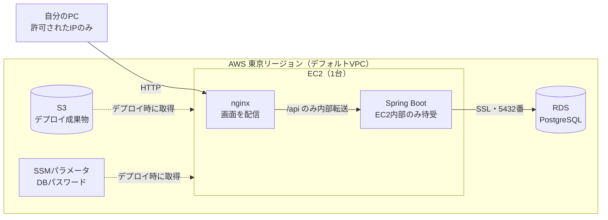
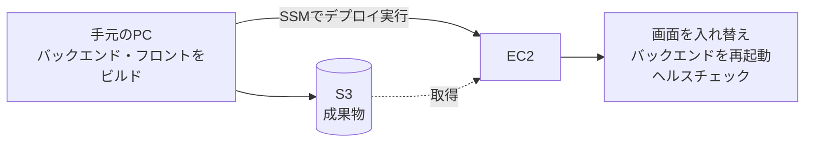

# 技術選定

[要件定義書](requirements.md)に戻る

## 1. 経緯

当初は、サーバー・データベースを持たず`localStorage`のみで完結する構成を想定していた。その後、実際のデータベースを用いた設計・構築・運用まで一通り学習したいという意向から、SQLite＋Node.js/Express＋Vanilla JavaScriptという構成を採用した。

さらに、実務でよく使われるJavaベースのフレームワーク（Spring Boot）やコンポーネント指向のフロントエンド（React）、本格的なDBサーバー（PostgreSQL）を用いた開発を経験したいという意向から、以下の構成に方針を変更した。

## 2. 採用技術

| 技術・仕組み | 選定理由 |
|---|---|
| React（Vite、フロントエンド） | コンポーネント指向のUI構築を学ぶため。SPA（Single Page Application）として構築し、Next.js等のフルスタックフレームワークは今回は対象外とする |
| Java + Spring Boot（Gradle、バックエンドAPI） | 実務で広く使われるJava／Spring Bootの設計・実装（DIコンテナ、REST API実装等）を学ぶため。ビルドツールはGradleを使用する |
| PostgreSQL（データベース） | 本格的なDBサーバーを用いた設計・構築・運用を学ぶため |
| AWS（EC2・RDS・S3、クラウド実行環境） | 実際のクラウド環境へのデプロイ・運用を学ぶため。個人利用の課題のため、最小構成で無料クレジット枠内に収める（[5章](#5-インフラ構成aws)参照） |
| Terraform（IaC） | 環境をマネジメントコンソールの手作業ではなくコードで構築・再現・削除できるようにするため。AWS CLIとあわせて、コマンドラインから環境を構築する |

### 決定事項（実装フェーズで確定）

企画段階では保留していた以下の事項は、実装フェーズ着手時に決定した。

- **DBアクセス方式**：Spring Data JPA（ORM）を採用
- **スキーマ管理**：JPAの`ddl-auto=update`によるアプリ起動時の自動作成（マイグレーションツールは使わない）
- **PostgreSQLの実行環境**：ローカルはDocker Composeで構築

### 決定事項（デプロイフェーズで確定）

- **AWS上の実行環境**：EC2 1台にフロントエンド（nginx）とバックエンド（Spring Boot）を同居させ、DBはRDS（PostgreSQL）を用いる
- **環境構築の手段**：AWS CLIとTerraformによるコマンドライン構築（詳細は[5章](#5-インフラ構成aws)）

## 3. 実装バージョン

実装フェーズで確定した、各技術・ツールの具体的なバージョンは以下の通り。

### バックエンド（`backend/`）

| 項目 | バージョン | 参照元 |
|---|---|---|
| Java | 25 | `backend/build.gradle`（toolchain） |
| Spring Boot | 4.1.1 | `backend/build.gradle` |
| Gradle | 9.7.1 | `backend/gradle/wrapper/gradle-wrapper.properties` |
| ビルドツール | Gradle（Groovy DSL） | `backend/build.gradle` |
| DBアクセス | Spring Data JPA | `backend/build.gradle` |
| DBドライバ | org.postgresql:postgresql（実行時） | `backend/build.gradle` |
| 入力バリデーション | spring-boot-starter-validation | `backend/build.gradle` |
| 開発支援 | spring-boot-devtools（開発時のみ、jarには含まれない） | `backend/build.gradle` |
| コードフォーマッタ | Spotless（google-java-format 1.28.0） | `backend/build.gradle` |

### フロントエンド（`frontend/`）

| 項目 | バージョン | 参照元 |
|---|---|---|
| React | ^19.3.0 | `frontend/package.json` |
| React DOM | ^19.3.0 | `frontend/package.json` |
| TypeScript | ^7.0.2 | `frontend/package.json` |
| Vite | ^8.3.0 | `frontend/package.json` |
| @vitejs/plugin-react | ^6.1.1 | `frontend/package.json` |
| Lintツール | oxlint ^1.81.0 | `frontend/package.json` |

### データベース

| 項目 | バージョン | 参照元 |
|---|---|---|
| PostgreSQL（ローカル） | 16-alpine | `docker-compose.yml` |
| ローカルの実行環境 | Docker Compose | `docker-compose.yml` |
| PostgreSQL（AWS） | 16（RDS） | `infra/rds.tf` |

### インフラ（`infra/`）

| 項目 | バージョン・内容 | 参照元 |
|---|---|---|
| Terraform | 1.10以上（ロックにS3のネイティブロックを使うため） | `infra/provider.tf` |
| AWSプロバイダ | 5系 | `infra/provider.tf` |
| EC2のOS | Amazon Linux 2023（最新AMIを自動取得） | `infra/main.tf` |
| EC2上のJava | Amazon Corretto 25（バックエンドのJavaバージョンと一致させる） | `infra/user_data.sh` |
| EC2上のWebサーバー | nginx | `infra/user_data.sh` / `infra/app-setup.sh` |
| リージョン | 東京（ap-northeast-1） | `infra/variables.tf` |

## 4. 検討した代替案と不採用理由

| 代替案 | 不採用理由 |
|---|---|
| Vanilla JavaScript（フロントエンド） | 当初はDOM操作の基礎理解を優先して採用していたが、コンポーネント指向のフロントエンド開発（React）を学ぶ方針に転換したため |
| Node.js + Express（バックエンドAPI） | 当初はフロントエンドと言語を統一する目的で採用していたが、実務で広く使われるJava／Spring Bootを学ぶ方針に転換したため |
| SQLite（データベース） | 当初は環境構築の負荷を抑える目的で採用していたが、本格的なDBサーバー（PostgreSQL）を用いた設計・運用を学ぶ方針に転換したため |
| Next.js | フロントエンドをSPAとして構築し、React単体でのコンポーネント設計・状態管理・API連携を学ぶことを優先するため、今回は対象外とした |
| Python（Flask／FastAPI）等の他言語バックエンド | Java／Spring Bootの学習を優先するため不採用 |
| Firebase等のBaaS | 仕組みがブラックボックス化しやすく、DB設計やAPI実装そのものを学ぶという目的に合わないため |
| dnd-kit等のドラッグ&ドロップライブラリ | [学習目標](requirements.md)としてドラッグ＆ドロップAPIそのものの実装経験を積むことを重視し、ライブラリに頼らずHTML5標準のDrag and Drop API（`draggable`／`onDragStart`等）を直接使用する方針としたため不採用 |
| ECS Fargate＋ALB＋CloudFront＋NAT Gateway等の一般的なWeb構成（AWS） | 個人利用の課題には過剰で、時間課金が大きく無料クレジットを急速に消費するため不採用。EC2 1台への同居を採用した |
| EKS（Kubernetes） | 学習対象としては範囲が広く、費用も大きいため不採用 |
| EC2上へのDB同居（AWS） | 最も安価だが、EC2を作り直すとデータが消えるため不採用。DBはRDSに分離した（実務に近い構成を学ぶ目的もある） |
| EC2上でのビルド（AWS） | メモリが小さく、Gradleビルドが遅く不安定になるため不採用。手元でビルドしてS3経由で届ける方式とした |
| CloudFormation・マネジメントコンソールでの手作業（AWS） | コードで再現でき、コマンドだけで作成・削除できるTerraformを優先したため不採用 |

学習目的の観点から、実務での最適解よりも「実務でよく使われる技術・仕組みの理解を優先する」ことを技術選定の軸とした。

## 5. インフラ構成（AWS）

ローカル環境に加えて、AWS上でもアプリを動かす。ここでは環境の構成と方針をまとめる（具体的な設定値やコードは`infra/`を直接参照する）。

### 5.1 目的と方針

- 実際のクラウド環境へのデプロイ・運用を学ぶ。個人利用の課題のため、**最小構成**とし、新規アカウントの無料クレジット枠内に収める
- マネジメントコンソールの手作業ではなく、**AWS CLIとTerraformでコマンドラインから構築**する。環境はコード（`infra/`）で再現でき、削除・作り直しもコマンドで行う
- 一度に作らず、**段階的に構築**して各段階で動作確認する（EC2 → RDS → アプリのデプロイ）

### 5.2 構成図



図が表示されない環境向けに、テキスト版も載せる。

```
自分のPC（許可されたIPのみ）
   │ HTTP
   ▼
┌─ AWS 東京リージョン（デフォルトVPC）──────────────
│  [EC2 1台]
│    ├ nginx ── 画面（HTML/JS/CSS）を配信
│    │    └ /api だけを内部転送 ──▶ Spring Boot（EC2内部のみ待受）
│    │                                   │ SSL
│    │                                   ▼
│  [RDS PostgreSQL]  ← インターネット非公開・EC2からのみ接続可
│
│  [S3] デプロイ成果物（jar・画面）── デプロイ時にEC2が取得
│  [SSMパラメータ] DBパスワード ── デプロイ時にEC2が取得
└───────────────────────────────────────────────
```

### 5.3 構成要素

| 要素 | 役割 |
|---|---|
| EC2 | フロントエンド（nginx）とバックエンド（Spring Boot）を1台に同居させるサーバー。nginxが画面を配信し、`/api`だけをバックエンドへ中継する（ブラウザから見ると同一サイトへのアクセスになるため、CORSの設定は不要） |
| RDS（PostgreSQL） | データベース。インターネットには公開せず、EC2からのみ接続できる |
| S3（成果物用） | 手元でビルドしたjarと画面のファイルを置き、EC2がそこから取得する |
| S3（state用） | Terraformのstate（構築済みの記録）を保管する（版管理・暗号化）。他の要素とは別に、最初に1回だけ作成する |
| SSM Session Manager | SSH鍵なしでEC2へ接続し、コマンドを実行する仕組み。デプロイの実行にも使う |
| SSMパラメータストア | 自動生成したDBパスワードを暗号化して保管する |
| IAM | EC2に付与する権限。接続と、必要な読み取りだけに絞る |
| セキュリティグループ | 通信の許可範囲。EC2用とDB用の2つ |
| VPC | アカウントにもともとあるデフォルトVPCを利用する（新規作成しない） |

### 5.4 セキュリティ方針

アプリにはログイン機能・認証機能がないため、**通信の入口を絞ることで守る**。

- 画面・APIへのアクセス（HTTP）は、**許可した自分のIPアドレスのみ**。全世界への公開は、Terraformの変数チェックで拒否する
- DBは**インターネットに公開せず**、EC2のセキュリティグループからのみ接続できる（IPアドレスではなくグループで許可する）。接続はSSL必須
- EC2へのSSH（22番）は開けず、**SSM経由で接続**する
- バックエンド（Spring Boot）はEC2内部でのみ待ち受け、外部に公開するのはnginxだけ
- ディスク・DB・S3は暗号化し、S3は外部公開を禁止する
- DBパスワードはコードやチャットに書かず、Terraformで自動生成してSSMパラメータに保管し、EC2が実行時に取得する。Terraformのstateにも含まれるため、stateのバケットは非公開・暗号化とする
- 実値の変数ファイル・state・plan結果はGit管理に含めない
- IAMは必要最小限の権限とする

### 5.5 デプロイの流れ



1. 手元のPCで、バックエンド（jar）とフロントエンド（静的ファイル）をビルドする（EC2はメモリが小さいため、EC2上ではビルドしない）
2. 成果物をS3へアップロードする
3. SSM経由でEC2上のデプロイスクリプトを実行し、成果物の取得 → 配置 → バックエンドの再起動 → 起動確認を行う

これらは`bash infra/deploy.sh`の1コマンドで実行できる。実行手順は[README](../README.md)の「AWSデプロイ」を参照。

### 5.6 `infra/`のディレクトリ構成

```
infra/
├── bootstrap/                 Terraformのstate置き場（S3）を作る。最初に1回だけ実行
├── backend.tf                 stateの保存先の設定
├── provider.tf                Terraform・プロバイダのバージョン、共通タグ
├── variables.tf               入力変数（アクセスを許可するIPの範囲など）
├── main.tf                    EC2・IAMロール・EC2用セキュリティグループ
├── rds.tf                     RDS・DB用セキュリティグループ・DBパスワードの保管
├── artifacts.tf               デプロイ成果物用のS3と、EC2の読み取り権限
├── outputs.tf                 構築後に表示する値（URL・接続先など）
├── user_data.sh               EC2の初回起動時の初期設定（Java・nginx等の導入）
├── app-setup.sh               アプリ実行用の設定（サービス登録・nginx設定・デプロイスクリプトの配置）
├── deploy.sh                  手元でビルドし、S3経由でEC2へ配置するスクリプト
└── terraform.tfvars.example   変数の記入例（実値の`terraform.tfvars`はGit管理外）
```

EC2の初回設定（`user_data.sh`と`app-setup.sh`）はコードに含まれているため、EC2を作り直しても同じ状態に戻る。DBはRDSにあるため、EC2を作り直してもデータは消えない。

### 5.7 設計判断と制約

- **EC2 1台への同居**：最小構成のため。フロントエンドをS3＋CloudFrontへ分離する構成は、将来の検討事項とする
- **HTTPのみ・単一障害点**：HTTPS・独自ドメイン・冗長化は行わない（個人利用のため）。パブリックIPはEC2の停止・再起動で変わる
- **学習用の割り切り**：RDSは削除保護・最終スナップショットなしとし、`terraform destroy`で確実に消せる。**削除するとDBのデータは残らない**
- **費用**：新規アカウントは無料枠ではなくクレジットを消費する方式のため、無料ではない。環境を起動したままにするとクレジットを消費し続けるので、使わない期間は`terraform destroy`で削除する
- **自分のIPが変わった場合**：許可IPとずれてアクセスできなくなるため、変数を更新して再適用する
